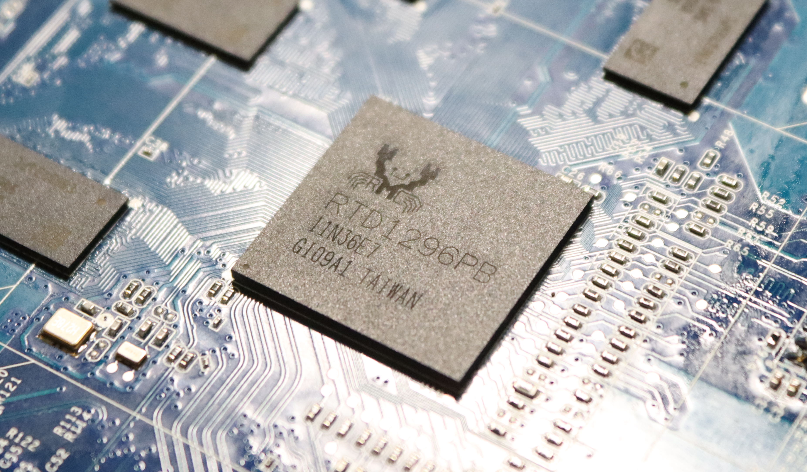

# Pictures

## The full PCB:

## CPU - RealTek RTD1296

## Samsung DDR4 RAM

## Debug edge connector

J2 is a debug connector. Looking from the front the pinout is:

|5 - ???|3 - ???|1 - 3.3V|
|---|---|---|
|6 - **RX**|4 - **TX**|2 - **GND**|

The serial is 115200 8N1.

## PCB and components

* 1: Realtek RTD1296 CPU.
* 2: 4x Samsung K4A4G165WE DDR4
* * x16 bus
* * 4Gb / chip
* * 512MB / chip
* * Total of 2GB RAM.
* 3: PIC board management CPU
* 4: Debug connector
* 5: Boot SPI flash
* * MIXC mx25l6433f